# GMLake: Efficient and Transparent GPU Memory Defragmentation for Large-scale DNN Training
A easy, efficient, transparent and open AI framework plugin for enabling end-to-end model tarining and inference at all scales.


## What is GMLake
Deep learning (DL) frameworks, e.g., PyTorch and TensorFlow, have emerged as the fundamental infrastructure for DNN models due to its flexibility and computational efficiency. Those DL frameworks have enabled the training of increasingly large and complex neural network models. Meanwhile, the GPU architecture have become the most widely used hardware platform to support the high-performance execution of DNN models. On the other side, the growing scale and complexity of DNN models poses new challenges to GPU memory management. For instance, using the CUDA’s native memory allocation APIs like cudaMalloc and cudaFree incurs a large overhead. To improve the efficiency of GPU memory allocation, DL frameworks opt to implement a caching allocator that maintains a memory pool with the best fit with coalescing (BFC) algorithm. Our experimental results show that the caching allocator outperforms the native memory allocator by almost 10×.

On the other side, the rapid growth in the memory requirements of large-scale DNN models has sparked the development of methods at the system- and algorithm-level to alleviate memory demands. Examples for these methods include recomputation, offloading, distributed training and low-rank adaptation. Even though these optimizations can effectively reduce memory footprint for training or fine-tuning large-scale DNN models, they may sometimes lead to poor memory utilization. The reason is that they also introduce a significant amount of regularity and dynamicity in the memory allocation requests, which results in up to 30% GPU memory fragmentation.

To mitigate GPU memory fragmentation and improve efficient memory utilization, this study focuses on exploring the causes of GPU memory fragmentation and proposes a novel memory allocation framework based on low-level GPU virtual memory management, called ***GPU memory lake (GMLake)***, to optimize GPU memory management with low overhead.
<div align="center">
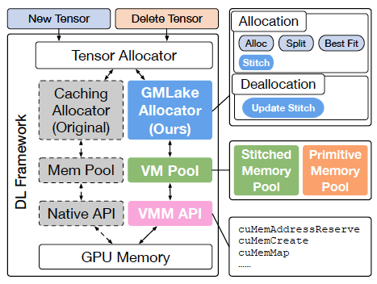
</div>

## Capabilities
GMLake employs a novel virtual ***memory stitching (VMS) mechanism***, which is seemingly a reverse behavior to the splitting.

A summary of GMLake includes:
* Compared to the original framework, it can fuse or combine non-contiguous memory blocks with a virtual memory address mapping
* It can further reduce the memory by utilizing the tensors between multi-streams
* It has implemented complete algorithms and data structures to support the LRU-based StitchFree.
* It has multi-stitch strategies

## Install
### On Linux
We have adapted GMLAKE to different versions of PyTorch, such as PyTorch-1.13.1, PyTorch-2.0, and pre-release PyTorch-2.1. The repository is the GMLake with PyTorch2.0. 
```
git clone -b release/2.0 https://github.com/pytorch/pytorch
cd pytorch
git submodule sync
git submodule update --init --recursive
cp ~/GMLake/CUDACachingAllocator.cpp ~/pytorch/c10/cuda
cp ~/GMLake/cuda_vmm_allocator.h ~/pytorch/c10/cuda
vim ~/pytorch/c10/cuda/CMakeLists.txt
alter target_link_libraries(c10_cuda PUBLIC c10 torch::cudart) -> target_link_libraries(c10_cuda PUBLIC c10 torch::cudart caffe2::cuda)
TORCH_CUDA_ARCH_LIST="8.0" USE_CUDA=1 python setup.py install
```

## Docker Image
Using pre-built images. You can alse pull a pre-built docker images from Docker Hub and run with docker
```
sudo docker run -td --net=host --ipc=host -e NVIDIA_VISIBLE_DEVICES=all -e NVIDIA_DRIVER_CAPABILITIES=all easydl/glake:v1
```

## Quick Start
You can launch a model training with following environment variables:
```
export vmmDefragment=1
export autoGC=80
export fragLimit=1073741824
export reuseLimit=10
export defragLevel=0
```

## Documentation and Tutorial
For more about environment variables and best tutorial, you can vist:
* *[GMLake best tutorial documents](docs/GMLake-tutorial.md)*

## Training Performence Evaluation
To measure the memory fragmentation, we first calculate the memory utilization ratio, which equals peak active memory divided by peak reserved memory. The fragmentation ratio equals (1−utilization ratio). The term “active memory” refers to the cumulative memory occupied by all active blocks, currently allocated by high-level tensors and utilized within DNN computations. On the other hand, “reserved memory” pertains to the total memory allocation set aside by both PyTorch and GMLAKE. These metrics are recorded at their respective peak values. While the reserved memory typically stabilizes as the training process runs, fluctuations in active memory are more substantial due to tensor (de)allocations during model execution. Given the caching mechanism, the peak active memory is pertinent for utilization or fragmentation analysis.

### Scalability on Memory-efficient Strategy
To explore the scalability of GMLAKE in terms of memory efficient strategies, we conduct finetuning experiments on OPT-1.3B, Vicuna-13B, and GPT-NeoX-20B models using Deepspeed Zero3 with four NVIDIA A100 (80 GB) GPUs, all under a common batch size. Notably, our evaluation entails influential memory-efficient strategies, including LoRA, gradient-checkpointing (recomputation), and offload. Thus, we systematically employ combinations of these strategies during our assessment. We label the no strategy scenario as N, recomputation as R, recomputation coupled with LoRA as LR, recomputation with offload as RO, and the joint utilization of recomputation, LoRA, and offload as LRO. Complicated strategies lead to fragmentation. The following figure illustrates the utilization ratio and reserved memory consumption. The models shown in the figure from left are OTP-1.3B, Vicuna-13B and GPT-Neox-20B. In a comprehensive overview, the increase in utilization ratio and reduction in reserved memory, when contrasted with PyTorch, ranges from approximately 5% to 29% (or is around 4 GB and up to 17 GB), respectively. 
<div align="center">
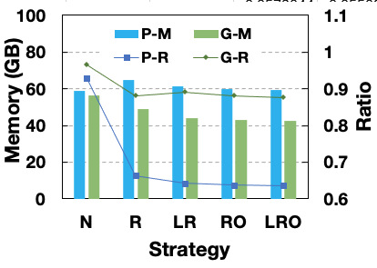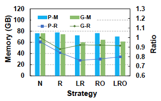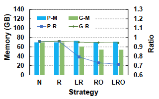
</div>

### Scalability on GPU Scale-out
Employing LR strategies along with the Deepspeed platform, we proceed to evaluate GMLAKE’s scalability in the context of GPU scale-out. This evaluation entails scaling from 1 GPU to 16 GPUs incrementally. We also conduct finetuning experiments on OPT-13B, Vicuna-13B and GPT-Neox-20B. As depicted in Figure(from left, the models are OPT-13B, Vicuna-13B and GPT-Neox-20B), GMLAKE consistently exhibits lower fragmentation ratios (high utilization ratio) and reserved memory consumption. Particularly noteworthy is the case of GPT-NeoX-20B in Figure , where the utilization ratio and reserved memory reduction can be as substantial as 23% or 17 GB, respectively. Moreover, the trend becomes evident that, as the number of GPUs increases, GMLAKE effectively maintains a utilization ratio of approximately 90% (i.e., fragmentation ratio less than 10%).
<div align="center">
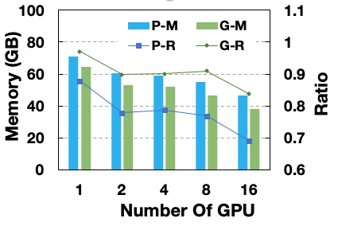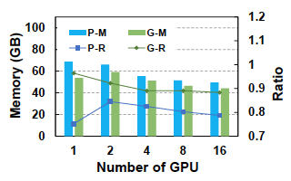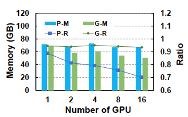
</div>

### Scalability on Various Platforms
We utilize various platforms including Deepspeed, FSDP, and Colossal-AI to conduct finetuning on the OPT-13B, GLM-10B, and GPT-2 models, respectively. This process employs static optimizing strategies, specifically LoRA and recomputation, and involves the use of four NVIDIA A100 (80 GB) GPUs. As illustrated in Figure , the results demonstrate a noteworthy decrease in both fragmentation and reserved memory, with reductions ranging from approximately 10% to 30%, and from 7 GB to 25 GB, respectively. These results confirm the high scalability exhibited by GMLAKE on various optimized training platforms.
<div align="center">
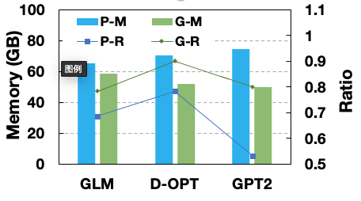
</div>

### End-to-End Effectiveness of GMLAKE
In this study, we conduct a comparative analysis between GMLAKE and the PyTorch caching allocator through end-to-end fine-tuning of LLMs, utilizing varying batch sizes. This evaluation uses four A100 GPUs and enables LoRA, recomputation, and Zero3 optimizations on both frameworks. Figure(form left, the models are OPT-1.3B, OPT-13B and GPT-Neox-20B) shows that GMLAKE consistently demonstrates a substantial reduction in peak memory consumption across a range of model sizes from 1.3 to 20 billion parameters. Notably, this memory consumption mitigation exhibits scalability with increasing model sizes while maintaining a consistent batch size. The efficacy of memory usage is also demonstrated by the trends presented in Figure . Significantly enhanced performance is evident in comparison to the baseline. Notably, as the model size increases, memory efficiency reaches levels exceeding 95% (as seen with the 13 billion and 20 billion parameter models), indicating minimal fragmentation and waste.
<div align="center">
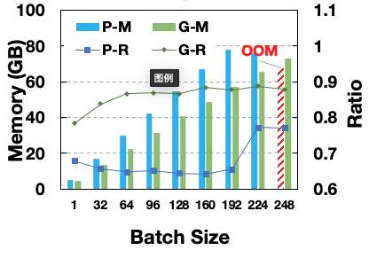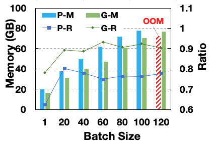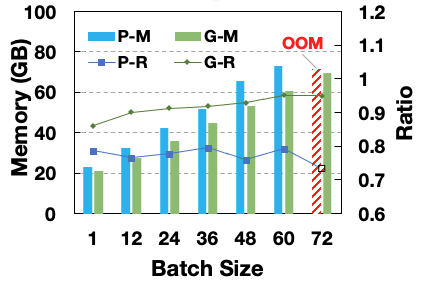
</div>


## GMLake Roadmap
Our future plan includes but not limited to:
* To solve the problem of KV Cache fragmentation in the inference, while ensuring transparency to the upper-level model and optimizing throughput.
* To further reduce memory fragmentation in the training scenario, ensuring it is reduced to below 5%
* Expanding GMLake to more AI frameworks such as TensorFlow and ONNXRuntime
* Expanding the functionality of GMLake from managing a single GPU memory pool to managing 8 GPU memory pool


