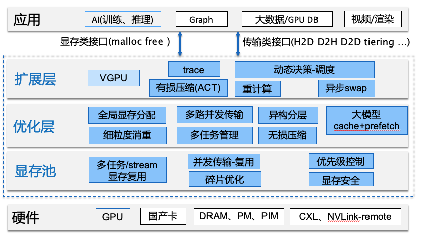
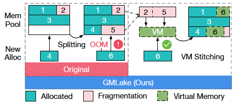
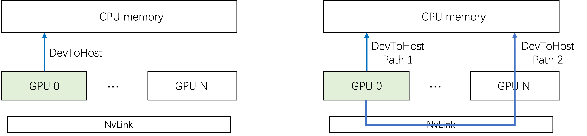
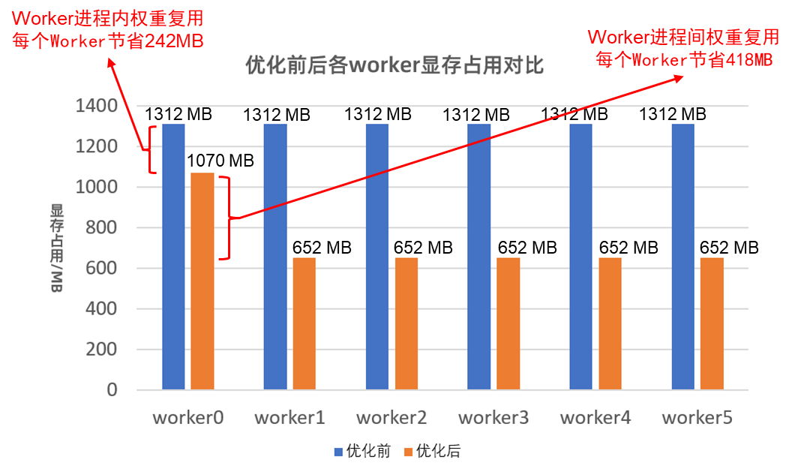

# GLake：GPU显存与传输优化

## 最新消息
- 【2024.5】AICon-2024 (北京，2024.5)大会上GLake overview & recent update 演讲材料 [下载](https://github.com/intelligent-machine-learning/glake/blob/main/docs/%E8%9A%82%E8%9A%81-GLake%E6%98%BE%E5%AD%98%E4%B8%8E%E4%BC%A0%E8%BE%93%E4%BC%98%E5%8C%96-AIConf-V1.0.pdf)
- 【2024.5】ASPLOS24会议上分享的slides可以访问[链接](https://docs.google.com/presentation/d/1ZM7OfvOMc5zZ2oIGJONhs_gFqsMLjTogNtD0I59TNfE/edit#slide=id.p1)
- 【2024.5】预告：serverless：根据负载**自动shrink显存**（ckpt到CPU），进程保活，请求达到时自动数据回填。
- 【2024.4】预览：优化 **大模型推理KV cache** 管理开发完成，一种不同于PagedAttention的更灵活、高效的方式。 
- 【2024.4】预览：**跨stream**的显存优化即将发布；与PyTorch ExpandSegment集成进行中（与Aliababa贡献者合作） 
- 【2024.3】提供兼容 PyTorch-1.13.1版本，branch torch-1.13.1
- 【2024.1】GMLake: Efficient and Transparent GPU Memory Defragmentation for Large-scale DNN Training with Virtual Memory Stitching, 已被 **ASPLOS24** 接收，URL: https://arxiv.org/abs/2401.08156

## 简介
AI大模型训练与推理面临越来越严重的“显存墙”与“传输墙”问题，即显存容量与传输带宽赶不上模型大小增长速度，亟需更多优化方案。

GLake是个工作在底层（虚拟与物理显存管理）与系统层（包括多卡、多通道、多任务）的加速库以及相关工具集，尝试对显存+传输进行一体优化。GLake使AI模型更充分利用底层硬件资源，训练吞吐提升最高4倍，推理显存节省可达3X，传输加速最高3~12X。

最简单的方式是直接替换底层lib（如libcuda.so 或libc10_cuda.so），当然正规方式是使用镜像或者安装whl包。

### 动机
- **显存瓶颈**：GPU加速卡以高算力、高并发著称。但作为外设，其显存容量（主流训练卡A100最高80GB，主流推理卡A10为24GB）还是明显制约了算力的高效发挥，尤其近年来大模型对显存容量的需求远高于显存硬件的发展。
- **传输瓶颈**：对比GPU算力和显存、传输的硬件指标，不难发现显存墙和传输墙均是短板，且短期难以有效扭转，而基于定制硬件NVLink互联，卡间传输带宽相比PCIe性能大幅领先。此外，显存带宽（HBM、GDDR）在大模型推理上的性能瓶颈。

### 架构
GLake总体架构如下图所示，基于分层设计（当前主要是基于PyTorch和NVIDIA GPU，正在对接更多国产卡）：

- **硬件接口层**：包括加速卡和互联，目前主要是基于NV GPU（支持NVlink、P2P、Unified Addressing、VMM、IPC等），在适配支持国产AI卡，未来考虑支持新型互联（如CXL）。
- **显存池**：提供全局、异构显存池，内置显存碎片优化、多stream-进程复用、安全等特性。
- **核心优化层**：提供增值优化功能，包括全局分配、多路并发、分层、重复数据消重、KV-cache优化等。
- **扩展层**：结合框架和团队自研的VGPU，提供参考集成方案或扩展，例如PyTorch等。
- **应用和生态**：可支持的不同应用场景，目前以AI为主（训练、推理），后续将考虑覆盖图、渲染等。

### 特点
- **高效**：通过显存内部两层管理和全局（多卡、多任务）优化实现显存pooling、sharing和tiering，为训练和推理提供更大的可用显存；通过多通道并发加速传输3~12X
- **易用**：核心功能对模型透明无需修改，包括训练和推理，可插拔到现有引擎上（如PyTorch）；可在任务运行时实时观测显存内部情况（包括碎片）
- **开放、易扩展**：将提供可配策略（例如压缩、数据校验、不同级别的安全检查等）
- **安全**：针对显存越界等问题排查困难，将内置显存越界检测机制帮助诊断
   
### 快速结果
1. 典型模型最大可减少碎片率27%，节约显存25G，10B模型训练吞吐最高提升近4倍。
2. 推理显存跨进程、跨模型支持重复显存重复消除，节省显存3X。
3. 加速CPU-GPU数据传输，传输性能提升3X+。
   
## 使用用例
[GMLake tutorial](../GMLake/README.md)
[Multi-path tutorial](../MultiPath/README.md)

## 工作原理
- **GMLake** 当没有整块空闲显存满足申请请求时，GMLake会把空闲碎片拼接成一块地址连续的显存返回给用户。

- **Multi-path** 利用系统内多条CPU-GPU传输路径，同时传输。

- **重复数据消除** 推理场景自动发现内容重复的显存占用，实现细粒度、跨进程自动共享。

## 路线图
我们正在以下几个方向上继续开发或规划，非常期待感兴趣的同学多交流、参与和共建：
- **LLM KV-cache**：针对大模型推理KV-cache碎片问题，采用不同于vLLM的方式，希望能更简洁高效（特别是复用现有的高效kernel）
- **cache-prefetch**：优化fine-tuning、推理时的offloading和prefetch（在DeepSpeed基础上），希望能深入（包括到L2 cache）
- **tiering**: 高效管理多卡、多任务、多种介质的内存
- **数据消重**：推理或者serverless场景下，对权重等RO数据按细粒度block只分配一份，可跨进程、自动识别
- **显存诊断排查**：基于显存池，为显存越界、异常提供更方便、高效的排查工具
- **国产卡支持**：NV GPU之外，我们希望能有更多的选择
- **更多场景**：例如图学习、图计算、稀疏-向量查询等

## 交流群
微信群(7天有效期): 如果过期，请联系WX: 13051161982

